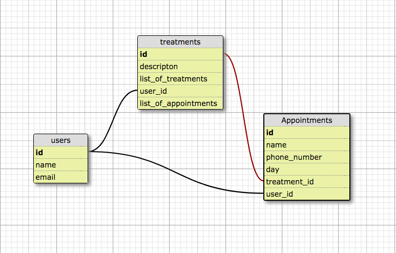

# Express MongoDB - Treatments


## Objectives

- Analyze Entity-Relationship Model.
- Create application from scratch.
- You as a team will define the corresponding sprints:

  1) A patient can carry out the control of their medical treatments.
  2) Each medical treatment will have a series of appointments scheduled.
  3) A patient has several appointments.


## Entity-Relationship Model





## User Model

Create the corresponding endpoints for GET, POST, GET by Id, Update, GETALL treatments by userId.

Restriction: If user exists then send a 'Post Failed' message, if not, create it. Search will be done by email.

## Treatment Model


Create corresponding endpoints for POST, GET, GET by Id and GETALL appointments by treatmentId.

Restriction:

  - An 'appointment' collection will be created for each item in the list of treatments ('t1', 't2' ...) provided by the user.

  - When creating a treatment 'treatment' collection, according to the list of treatments ('t1', 't2' ...) received by the user, the appointments list (array of appointment's id's) of the 'treatment' collection will be updated for each document created in the 'appointment' collection.


#### Output Examples

`POST http://localhost:3000/api/v1/treatments`

```
//Treatment collection

{
    "type": "Treatment created",
    "data": {
        "listOfTreatments": [
            "t7",
            "t8",
            "t9"
        ],
        "appointments": [
            "5c4fa9624ff69608033e6a40",
            "5c4fa9624ff69608033e6a41",
            "5c4fa9624ff69608033e6a42"
        ],
        "_id": "5c4fa9624ff69608033e6a3f",
        "description": "testing",
        "user": "5c4e15c78e9a367179fe44a1",
        "__v": 1
    }
}
```

`http://localhost:3000/api/v1/treatments/5c4fa9624ff69608033e6a3f/appointments`

```
{
    "type": "Appointments found",
    "data": [
        {
            "_id": "5c4fa9624ff69608033e6a40",
            "name": "Marco Z.",
            "phoneNumber": "5521887690",
            "day": "t7",
            "treatment": "5c4fa9624ff69608033e6a3f",
            "user": "5c4e15c78e9a367179fe44a1",
            "__v": 0
        },
        {
            "_id": "5c4fa9624ff69608033e6a42",
            "name": "Marco Z.",
            "phoneNumber": "5521887690",
            "day": "t9",
            "treatment": "5c4fa9624ff69608033e6a3f",
            "user": "5c4e15c78e9a367179fe44a1",
            "__v": 0
        },
        {
            "_id": "5c4fa9624ff69608033e6a41",
            "name": "Marco Z.",
            "phoneNumber": "5521887690",
            "day": "t8",
            "treatment": "5c4fa9624ff69608033e6a3f",
            "user": "5c4e15c78e9a367179fe44a1",
            "__v": 0
        }
    ]
}
```


`GET http://localhost:3000/api/v1/treatments` 

```
//Treatment collection


{
    "type": "Reading Treatments",
    "data": [
        {
            "listOfTreatments": [
                "t1",
                "t2",
                "t3"
            ],
            "appointments": [
                "5c4e2bedc9e7a87bb403d54c",
                "5c4e2bedc9e7a87bb403d54d",
                "5c4e2bedc9e7a87bb403d54e"
            ],
            "_id": "5c4e2bedc9e7a87bb403d54b",
            "description": "testing",
            "user": "5c4e15c78e9a367179fe44a1",
            "__v": 1
        },
        {
            "listOfTreatments": [
                "t4",
                "t5",
                "t6"
            ],
            "appointments": [
                "5c4e3eb147f87d84a8fa3431",
                "5c4e3eb147f87d84a8fa3432",
                "5c4e3eb147f87d84a8fa3433"
            ],
            "_id": "5c4e3eb147f87d84a8fa3430",
            "description": "testing",
            "user": "5c4e15c78e9a367179fe44a1",
            "__v": 1
        }
    ]
}  
```

For each item in appointments array of 'treatment' collection there is a 'appointment' document created.

`GET http://localhost:3000/api/v1/treatments/5c4e2bedc9e7a87bb403d54b/appointments` 

```
//Appointment collection

{
    "type": "Appointments found",
    "data": [
        {
            "_id": "5c4e2bedc9e7a87bb403d54c",
            "name": "Marco Z.",
            "phoneNumber": "5521887690",
            "day": "t1",
            "treatment": "5c4e2bedc9e7a87bb403d54b",
            "user": "5c4e15c78e9a367179fe44a1",
            "__v": 0
        },
        {
            "_id": "5c4e2bedc9e7a87bb403d54d",
            "name": "Marco Z.",
            "phoneNumber": "5521887690",
            "day": "t2",
            "treatment": "5c4e2bedc9e7a87bb403d54b",
            "user": "5c4e15c78e9a367179fe44a1",
            "__v": 0
        },
        {
            "_id": "5c4e2bedc9e7a87bb403d54e",
            "name": "Marco Z.",
            "phoneNumber": "5521887690",
            "day": "t3",
            "treatment": "5c4e2bedc9e7a87bb403d54b",
            "user": "5c4e15c78e9a367179fe44a1",
            "__v": 0
        }
    ]
}

```


## Appointment Model


Create the corresponding endpoints for GET, GET by Id.


## Conventions:

- Database name: treatment-api
- Attributes of each object:

    - User: id, name, email (not null, unique)
    - Appointment: name, phoneNumber, day.
    - Treatment: id, description, listOfTreatments, appointments.


>> Note: At this stage of the application, the handling of dates in the treatment list does not matter (only handle them as string: 't1', 't2', etc.).
